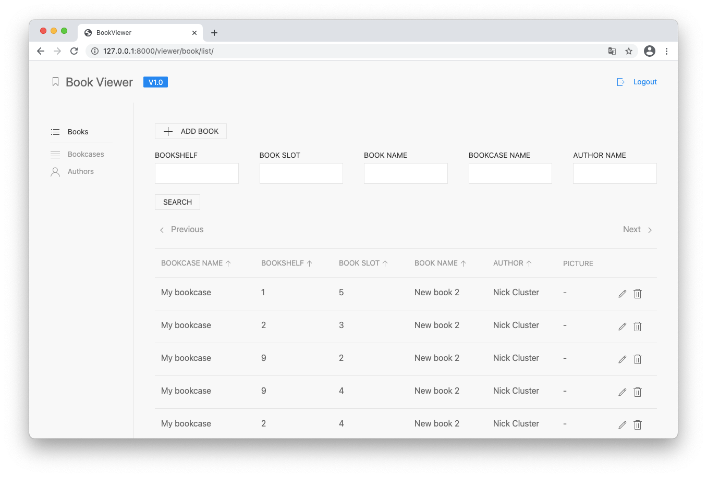

# Book Viewer

A simple app to manage your personal library

### Requirements

* `Django~=3.1.6` 
* `Pillow~=8.1.0`
* `btc-template-tables~=0.4.2`
* `django-filter~=2.4.0`

---
* `honcho~=1.0.1`


### Environment variables
```
DEBUG=True
SECRET_KEY=your_key
DATABASE_NAME=book_viewer_db
DATABASE_USER=postgres_user
DATABASE_PASSWORD=postgres_pass
DATABASE_HOST=localhost
DATABASE_PORT=5432
```

### Installation

```bash
honcho start migrate
```

```bash
honcho start django
```

### Example


